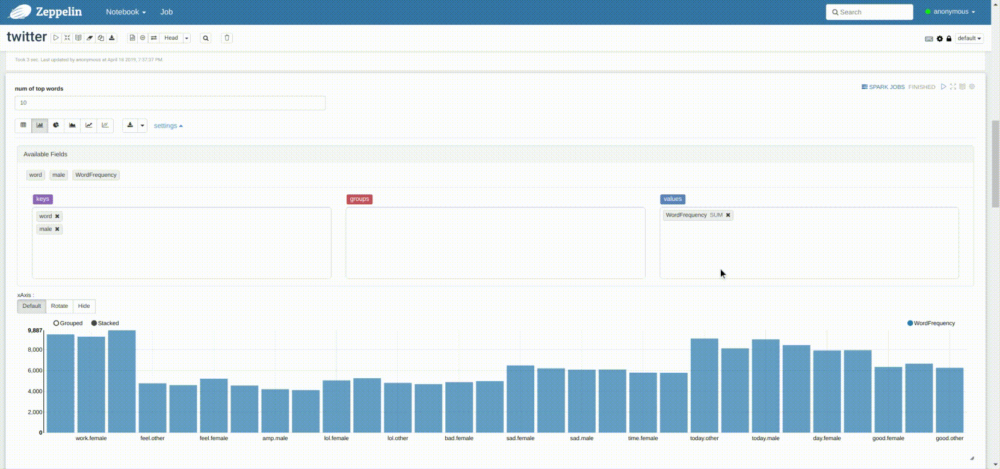

# CS651 Twitter visualization

*By Han Weng(CS651), Hao Dong(CS631)*

This is a course project for CS 651 Data-Intensive Computing. It implements a system which extracts trends based on real-time tweets data using Spark Streaming. The system can be fully distributed, with the help of Apache Flume, Apache Kafka, Apache ZooKeeper and it has great robustness and flexibility. 

More information about it can be found in the PDF version report: `./report/`

We implemented two views to visualize the data: a real-time streaming and a dashboard:

* The streaming plot (words in demo: today, work, day, sad, night)

* The dashboard:

  

  

### Running guide

- The `config/` folder, `logs/` folder, `start_server.sh` and `kill_server.sh` are for starting/stopping server, including creating related log/conf/other intermediate files or deleting those files.

- All source files goes to `src/` and `MakeTweets/`:
  - Spark Streaming: `src/main/scala/`
  - For visualization using Apache Zeppeline: `src/zeppelin/`
  - For visualization using `lightning-viz`(real time plotting): `src/streaming-plot.py`